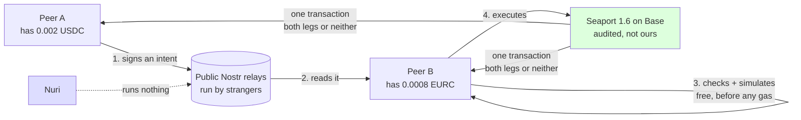
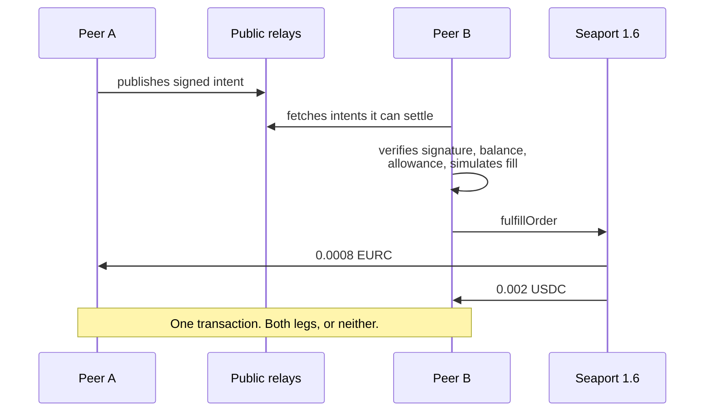
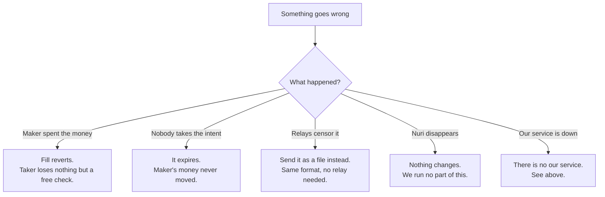

# nuri-p2p

A board where peers post intents and other peers fill them. Nobody in the middle.

An intent says what you give and what you want. `settle` names how it settles. Anyone who
understands that method can fill it — no allowlist, no registration, no operator. Today one method
works (two ERC-20 legs on Base, both moved in a single transaction). Bitcoin is the next one, and
adding it does not change the board, the page, or anybody else's client.

## How it works



The money never leaves a wallet until both sides move at once. There is no step where funds sit
somewhere waiting — so there is nothing to recover, no escrow, no recovery key.



## What happens when things go wrong



## Why not just use CoW

CoW has the better price and the better auction. But its settlement contract is `onlySolver`: a
peer cannot fill a peer's order, and joining the solver set means a pool plus onboarding. NEAR
Intents needs approval and KYC/KYB. Those are venues you send an order *to*.

This is the other thing: peers meeting directly, any taker, no permission. If you want the best
price on an EVM pair, use CoW. If you want two people — or two agents — to trade without asking
anyone, use this.

## The one rule

A settlement method is listed here if and only if **any taker can fill it**. That is what rules
out CoW (`onlySolver`) and NEAR (KYC). Methods register themselves in one file; the board never
parses their terms.

| method | legs | atomic | status |
|---|---|---|---|
| `seaport-1.6` | ERC-20 ↔ ERC-20 on Base | yes, one transaction | works, proven on mainnet |
| `htlc-v1` | Bitcoin / Lightning ↔ EVM | two locks, one secret | readable, `no_adapter_yet` |

## What is proven, and what is not

| claim | evidence |
|---|---|
| a real swap settles | **proven live** — Base mainnet, fill `0xe52248be…fee9476`, block 51271640, status 1. Maker 2000 USDC → 800 EURC, taker 800 EURC → 2000 USDC. Proof: `proofs/fill-30cd40bdde.json` |
| the board carries intents without us | **proven live** — published to three public relays, read back by a fresh client, signature and both legs intact |
| a stranger's client can read them | **proven live** — 20 lines of WebSocket, no code of ours, full understanding |
| the shipped page finds real intents | **proven live** — headless Chrome, real relays, two intents listed |
| a worthless offer costs the taker nothing | **proven live** — refused against Base before any gas |
| our order hash is what Seaport computes | **proven live** — asserted against `getOrderHash` on Base |
| Bitcoin works | **not yet** — `htlc-v1` parses and enforces timelocks, no adapter |

Verify the swap yourself:

```sh
cast receipt 0xe52248bee6a4e61f1162469102683a42db42abc9428595ad83379dc13fee9476 status --rpc-url https://base.drpc.org
```

## Layout

```
src/constants.mjs   addresses and values we depend on, all verified on chain
src/offer.mjs       build, sign and verify an offer
src/settle.mjs      the method registry: what settles, and by what rules
src/settle-seaport.mjs   the working method (Base, atomic)
src/settle-htlc.mjs      the Bitcoin method (parses, honestly not executable yet)
src/board.mjs       publish and read intents over Nostr, or as a file
src/fill.mjs        check, simulate and execute a fill
index.html          the whole product for a person, one file, works from file://
test/               43 tests, 8 of them read Base for real
scripts/prove.mjs         one real swap, end to end, writes a proof
scripts/prove-board.mjs   publishes an intent to public relays, reads it back
scripts/prove-stale.mjs   the evil twin: proves a dead offer costs the taker nothing
proofs/             signed evidence with transaction and event ids
SCHEMA.md           the intent format, so others can implement it
```

## Run it

```sh
npm install
npm test               # 43 tests, 8 of them read Base for real
npm run test:page      # the page in headless Chrome, offline
npm run test:live      # the page against the real public relays
npm run prove:board    # dry; add --publish to post to public relays
```

Open `index.html` in a browser. It works from `file://`, with no server.

`npm test` can never spend money: it holds no key and sends no transaction. Anything that moves
funds needs an explicit `--execute` and keys you supply.
